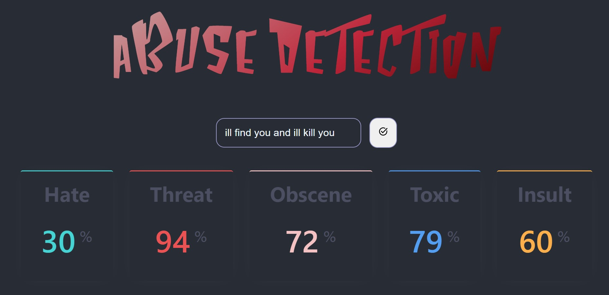

<!-- PROJECT LOGO -->
<br />
<div align="center">

<h1 align="center">Abuse Detection</h1>
  <p align="center">
   Abuse Detection project is a powerful and accurate web application that employs Python, Flask, and React to detect abusive content in usergenerated text. Leveraging state-of-the-art machine learning algorithms, the model boasts an impressive accuracy rate of 95%, making it a reliable tool for maintaining a safe and respectful online environment.
    <br />
  </p>
  <strong>Like the project ( UwU ) ?? we would appreciate if you give this repo a star⭐</strong>
</div>


<!-- ABOUT THE PROJECT -->
## Is that A threat or something else?

---
<div align="center">
    
 </div>
<p >
  Dont worry Our project can help you find if someone is threatning you and even more...
    <br />
  </p>


 <div align="center">
    
 </div>


<!-- GETTING STARTED -->
## Getting Started

Instructions on setting up your project locally.
To get a local copy up and running follow these simple steps.

---

### Installation

1. Clone the repo into your desired directory
   ```sh
   git clone https://github.com/Sourabh-Bharale/abuse-detection.git
   ```
2. Set up virtual env for python
   ```bash
    cd server
    python -m venv venv
    .\venv\Scripts\activate
    ```
3. install the necessary dependencies for python
   ```sh
   pip install flask flask-pymongo flask_cors scikit-learn
   ```
### Environment Variables
This projects stores and collects data on mongodb for furthur versions & improvements
</br>
you can create your own database and use it
inside /server/.env
`CONNECTION_STRING = YOUR_DATABASE_URL`

4. Start Flask server at localhost:5000/data
    ```sh
   python application.py
   ```
4. Install dependencies (only the first time)
   ```bash
   cd ../
   npm install
   ```
3. Run the local server at localhost:3000
   ```sh
   npm run start
   ```
    Now you are good to go 🚀

---

You can try out the app from `http://localhost:3000` and
View the Data on `http://localhost:5000/data`
